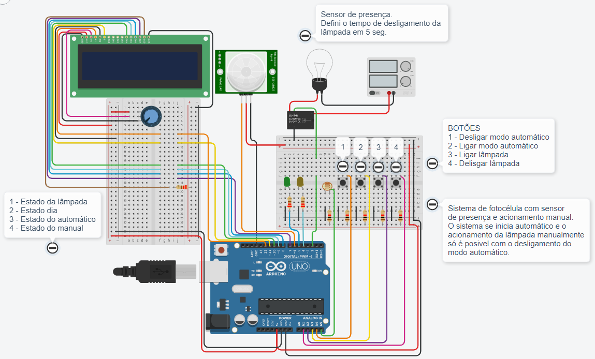

# IoT-Extensao 
Projeto do curso de Extensão IoT na prática para iniciantes  

1- Projeto fotocélula / sensor de presença com acionamento automático, manual e painel LCD.  

No TinkerCAD, crie o circuito igual a imagem abaixo:  

  
Na programação em texto, faça assim: 
<a href="22_09_03_aula_iot_trabalho_final1.ino">Clique aqui para o código</a>
  
Obs: 
Sensor de presença - Defini o tempo de desligamento da lâmpada no tempo que desejar.
  
Sistema de fotocélula com sensor de presença e acionamento manual. O sistema se inicia automático e o acionamento da lâmpada manualmente só é posivel com o desligamento do modo automático.   
BOTÕES 
1 - Desligar modo automático 
2 - Ligar modo automático 
3 - Ligar lâmpada 
4 - Delisgar lâmpada  
